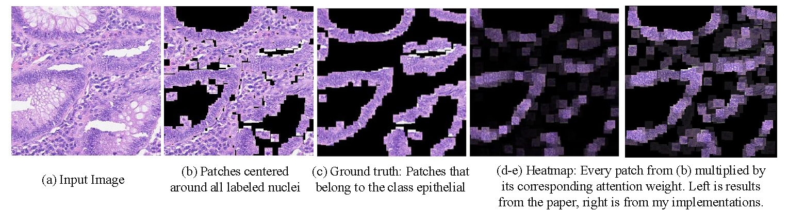

## Attention-based Deep Multiple Instance Learning
This is a re-implementation of ICML 2018 paper "Attention-based Deep Multiple Instance Learning" (https://arxiv.org/pdf/1802.04712.pdf). The official Pytorch implementation can be found [here](https://github.com/AMLab-Amsterdam/AttentionDeepMIL). We published one application ([MEDIA'20](https://www.sciencedirect.com/science/article/abs/pii/S1361841520301535?dgcid=rss_sd_all)) based on AttnMIL in survival learning, please check out this repo https://github.com/uta-smile/DeepAttnMISL_MEDIA if you are interested.

I believe it is a very interesting work and so I built it with **Keras** using Tensorflow backend. I wrote attention layers described in the paper and did experiments in colon images with 10-fold cross validation. I got the very close average accuracy described in the paper and visualization results can be seen as below. Parts of codes are from https://github.com/yanyongluan/MINNs.

When train the model, we only use the image-level label (0 or 1 to see if it is a cancer image). The attention layer can provide an interpretation of the decision by presenting only a small subset of positive patches.

---

### Results from my implementation

  

### Dataset
- Colon cancer dataset [[Data]](https://warwick.ac.uk/fac/sci/dcs/research/tia/data/crchistolabelednucleihe/)
- Processed patches [[Google Drive]](https://drive.google.com/file/d/1RcNlwg0TwaZoaFO0uMXHFtAo_DCVPE6z/view?usp=sharing)

I put my processed data here and you can also set up according to the paper. If you have any problem, please feel free to contact me.
